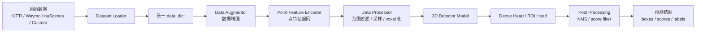

# OpenPCDet 项目分析与上手路线

本文档基于当前工作区中的 `G:\DFAC\WXY\OpenPCDet` 代码整理，目标是帮助你快速理解这个项目是做什么的、支持哪些数据和标签、怎样跑起来，以及后续该重点看哪些源码。

## 1. 项目定位

OpenPCDet 是一个基于 PyTorch 的 3D 点云目标检测框架。它主要处理 LiDAR 点云数据，输入是一帧或多帧点云，输出是场景中目标的 3D 检测框、类别和置信度。

它适合做这些事情：

- 自动标注点云中的车辆、行人、骑行者等 3D 目标。
- 训练 KITTI、Waymo、nuScenes、Lyft、ONCE、Argo2 等公开数据集上的 3D 检测模型。
- 适配自己的点云数据集，训练自定义类别模型。
- 使用已有 checkpoint 对 `.bin`、`.npy`、`.pcd` 点云文件做推理。

框架内部统一使用 3D box 表示：

```text
x, y, z, dx, dy, dz, heading
```

含义如下：

| 字段 | 含义 |
| --- | --- |
| `x, y, z` | 3D 框中心点坐标，通常在 LiDAR 坐标系下 |
| `dx, dy, dz` | 3D 框尺寸，分别表示长、宽、高 |
| `heading` | 目标朝向角，单位通常是弧度 |

训练时，框架会在 `gt_boxes` 最后一列追加类别 id，所以训练阶段常见实际格式是：

```text
x, y, z, dx, dy, dz, heading, class_id
```

## 2. 总体架构

OpenPCDet 的设计核心是“数据集和模型解耦”。不同数据集先被转换成统一的数据字典，再送进模型。不同模型也通过同一套模块化流程拼装。

整体流程可以理解为：



模型内部常见模块顺序在 `pcdet/models/detectors/detector3d_template.py` 中定义：

```text
vfe
backbone_3d
map_to_bev_module
pfe
backbone_2d
dense_head
point_head
roi_head
```

不是每个模型都会用到全部模块。例如 PointPillar 更轻量，PV-RCNN/PV-RCNN++ 会包含更复杂的点特征聚合和 ROI refinement。

## 3. 重要目录结构

当前项目关键目录如下：

```text
OpenPCDet
├── docs
│   ├── INSTALL.md
│   ├── GETTING_STARTED.md
│   ├── CUSTOM_DATASET_TUTORIAL.md
│   └── PROJECT_ANALYSIS_CN.md
├── tools
│   ├── train.py
│   ├── test.py
│   ├── demo.py
│   ├── cfgs
│   │   ├── dataset_configs
│   │   ├── kitti_models
│   │   ├── waymo_models
│   │   ├── nuscenes_models
│   │   ├── custom_models
│   │   └── argo2_models
│   └── inference
│       ├── fastAPI.py
│       ├── inference_nms.py
│       └── DataSet.py
├── pcdet
│   ├── config.py
│   ├── datasets
│   ├── models
│   ├── ops
│   └── utils
├── data
├── output
└── setup.py
```

各目录作用：

| 路径 | 作用 |
| --- | --- |
| `tools/train.py` | 训练入口 |
| `tools/test.py` | 测试/评估入口 |
| `tools/demo.py` | 简单点云推理 demo |
| `tools/cfgs/dataset_configs` | 数据集配置 |
| `tools/cfgs/*_models` | 不同数据集上的模型配置 |
| `tools/inference` | 当前项目额外加的推理服务和 NMS 封装 |
| `pcdet/datasets` | 数据读取、格式转换、评估逻辑 |
| `pcdet/datasets/dataset.py` | 所有数据集的基类，数据流最核心文件之一 |
| `pcdet/datasets/processor` | 点云特征编码、范围过滤、voxel 化 |
| `pcdet/datasets/augmentor` | 数据增强和 GT database sampling |
| `pcdet/models/detectors` | 检测模型入口类 |
| `pcdet/models/dense_heads` | 检测头，负责分类和 box 回归 |
| `pcdet/models/roi_heads` | 二阶段模型的 ROI refinement |
| `pcdet/ops` | CUDA 扩展算子，如 IoU、NMS、pointnet2、pooling |

## 4. 支持的数据集和类别

这份代码中已引入的数据集类包括：

| 数据集 | Loader 类 | 常见类别 |
| --- | --- | --- |
| KITTI | `KittiDataset` | `Car`, `Pedestrian`, `Cyclist` |
| Waymo | `WaymoDataset` | `Vehicle`, `Pedestrian`, `Cyclist` |
| nuScenes | `NuScenesDataset` | `car`, `truck`, `construction_vehicle`, `bus`, `trailer`, `barrier`, `motorcycle`, `bicycle`, `pedestrian`, `traffic_cone` |
| Lyft | `LyftDataset` | `car`, `truck`, `bus`, `emergency_vehicle`, `other_vehicle`, `motorcycle`, `bicycle`, `pedestrian`, `animal` |
| Pandaset | `PandasetDataset` | 通过 `TRAINING_CATEGORIES` 映射到训练类别 |
| ONCE | `ONCEDataset` | `Car`, `Bus`, `Truck`, `Pedestrian`, `Cyclist` |
| Argo2 | `Argo2Dataset` | 当前配置里有 26 个类别 |
| Custom | `CustomDataset` | 由配置文件中的 `CLASS_NAMES` 决定 |

本地自定义配置里还能看到几套类别方案：

```text
tools/cfgs/custom_models/pv_rcnn_plusplus_liangdao.yaml
CLASS_NAMES: ["car", "truck"]
```

```text
tools/cfgs/custom_models/pv_rcnn.yaml
CLASS_NAMES: ["pedestrian", "cyclist", "motorcycle", "car", "truck"]
```

```text
tools/cfgs/custom_models/pv_rcnn_plusplus.yaml
CLASS_NAMES: ["Pedestrian", "Moto_with_Person", "Cycle", "Cyclist_Heap", "car", "SUV", "Van", "Truck", "Post"]
```

注意：类别名大小写必须保持一致。比如 `Truck` 和 `truck` 在代码里是两个不同类别名。

## 5. 标签格式

### 5.1 框架内部标签

训练时数据最终会进入 `DatasetTemplate.prepare_data()`，它会完成：

- 根据 `CLASS_NAMES` 过滤不需要训练的类别。
- 将 `gt_names` 转成类别 id。
- 把类别 id 拼到 `gt_boxes` 最后一列。
- 调用数据增强、点特征编码、voxel 处理。

内部训练格式大致是：

```python
data_dict = {
    "points": points,
    "gt_names": ["car", "truck"],
    "gt_boxes": [
        [x, y, z, dx, dy, dz, heading],
        [x, y, z, dx, dy, dz, heading],
    ],
}
```

经过 `prepare_data()` 后，`gt_boxes` 变成：

```text
x, y, z, dx, dy, dz, heading, class_id
```

### 5.2 自定义数据标签

官方 custom 模板要求点云是 `.npy`，标签是 `.txt`。目录结构应为：

```text
OpenPCDet
└── data
    └── custom
        ├── ImageSets
        │   ├── train.txt
        │   └── val.txt
        ├── points
        │   ├── 000001.npy
        │   └── 000002.npy
        └── labels
            ├── 000001.txt
            └── 000002.txt
```

每个标签文件每行一个目标：

```text
x y z dx dy dz heading_angle category_name
```

示例：

```text
1.50 1.46 0.10 5.12 1.85 4.13 1.56 Vehicle
5.54 0.57 0.41 1.08 0.74 1.95 1.57 Pedestrian
```

当前本地 `data/custom/kitti/training/.../lidar/*.txt` 中的文件更像 KITTI 风格标签，第一列还有中文类别，如：

```text
汽车 ...
卡车 ...
面包车 ...
```

这和 `CustomDataset` 默认读取格式不一致。如果要用这批数据训练，需要先做一次格式转换，把它变成 `points/*.npy + labels/*.txt` 的格式，并把类别名映射到配置里的英文类别，例如：

```text
汽车 -> car
卡车 -> truck
面包车 -> van 或 car，取决于你的业务定义
```

## 6. 配置系统

OpenPCDet 的配置由 YAML 驱动。模型配置一般长这样：

```yaml
CLASS_NAMES: ['Car', 'Pedestrian', 'Cyclist']

DATA_CONFIG:
    _BASE_CONFIG_: cfgs/dataset_configs/kitti_dataset.yaml

MODEL:
    NAME: PVRCNN
```

也就是说，一个模型配置通常由两部分组成：

- `CLASS_NAMES`：训练/推理的类别列表。
- `DATA_CONFIG._BASE_CONFIG_`：引用某个数据集配置。
- `MODEL`：模型结构配置。
- `OPTIMIZATION`：训练超参数。

配置读取逻辑在 `pcdet/config.py`。`_BASE_CONFIG_` 会先被加载，再由当前 YAML 覆盖。

当前本地代码里有一些配置使用了 Linux 绝对路径：

```yaml
_BASE_CONFIG_: /workspace/OpenPCDet/tools/cfgs/...
```

如果在 Windows 当前路径直接运行，这类配置会找不到文件。需要改成项目内相对路径，例如：

```yaml
_BASE_CONFIG_: cfgs/dataset_configs/custom_dataset.yaml
```

或者在 Linux/容器里保持 `/workspace/OpenPCDet` 目录结构。

## 7. 当前本地项目状态

我对当前工作区做了一轮检查，结论如下：

### 7.1 环境状态

当前系统 Python 是：

```text
Python 3.12.4
```

但当前环境没有安装：

```text
torch
spconv
```

OpenPCDet 0.6.0 通常更适合这些环境：

- Linux 或 WSL2。
- Python 3.7、3.8、3.9 更稳。
- CUDA 可用。
- PyTorch 与 CUDA 版本匹配。
- spconv 与 PyTorch/CUDA 版本匹配。

Windows 原生跑会比较麻烦，主要卡在 CUDA 扩展编译和 spconv。

### 7.2 数据目录状态

当前工作区根目录有：

```text
G:\DFAC\WXY\mini\v1.0-mini
G:\DFAC\WXY\v1.0-trainval
G:\DFAC\WXY\OpenPCDet\data
```

OpenPCDet 的 nuScenes 配置默认找：

```text
OpenPCDet/data/nuscenes
```

但当前 `OpenPCDet/data` 下看到的是：

```text
nusenses
```

这个目录名疑似拼错。若要跑 nuScenes，应整理为：

```text
OpenPCDet/data/nuscenes/v1.0-mini
```

或：

```text
OpenPCDet/data/nuscenes/v1.0-trainval
```

### 7.3 自定义数据状态

当前 `OpenPCDet/data/custom` 中不是 custom tutorial 要求的标准结构。里面是：

```text
data/custom/kitti/training/2022-10-12-14-56-42/lidar/*.txt
```

而代码默认需要：

```text
data/custom/ImageSets/train.txt
data/custom/ImageSets/val.txt
data/custom/points/*.npy
data/custom/labels/*.txt
```

因此如果要训练自定义数据，需要先转换数据。

### 7.4 代码问题

当前 `pcdet/datasets/custom/custom_dataset.py` 存在，但 `CustomDataset` 没有注册进 `pcdet/datasets/__init__.py` 的 `__all__` 中。直接跑 `DATASET: 'CustomDataset'` 会失败。

需要增加类似：

```python
from .custom.custom_dataset import CustomDataset

__all__ = {
    ...
    'CustomDataset': CustomDataset,
}
```

此外，`tools/cfgs/dataset_configs/liangdao_custom_dataset.yaml` 里有一个明显拼写问题：

```yaml
filter_by_min_points: ['car:5', 'truck:5', 'motorcycle:5', 'pedestrian:5', 'pyclist:5']
```

这里的 `pyclist` 应该是 `cyclist`。

## 8. 跑起来的推荐路线

### 8.1 推荐先跑官方公开数据集

如果你的目标是先验证框架能跑起来，建议优先选择：

1. KITTI，小而经典，资料多。
2. nuScenes mini，当前工作区已有 mini 数据痕迹。
3. 自定义数据，等框架训练链路打通后再适配。

### 8.2 安装环境

建议在 Linux、WSL2 或 Docker 中创建环境：

```bash
conda create -n openpcdet python=3.8 -y
conda activate openpcdet
```

安装 PyTorch 和 spconv 时，要根据显卡驱动和 CUDA 版本选择对应包。安装完后再执行：

```bash
cd /workspace/OpenPCDet
python setup.py develop
```

`setup.py` 会编译项目里的 CUDA 扩展，包括：

- `iou3d_nms_cuda`
- `roiaware_pool3d_cuda`
- `roipoint_pool3d_cuda`
- `pointnet2_stack_cuda`
- `pointnet2_batch_cuda`
- `bev_pool_ext`
- `ingroup_inds_cuda`

如果这些扩展没有编译成功，训练和推理大概率跑不起来。

### 8.3 跑 KITTI

准备数据目录：

```text
OpenPCDet/data/kitti
├── ImageSets
├── training
│   ├── calib
│   ├── velodyne
│   ├── label_2
│   └── image_2
└── testing
    ├── calib
    ├── velodyne
    └── image_2
```

生成 info：

```bash
python -m pcdet.datasets.kitti.kitti_dataset create_kitti_infos tools/cfgs/dataset_configs/kitti_dataset.yaml
```

训练：

```bash
cd tools
python train.py --cfg_file cfgs/kitti_models/pointpillar.yaml --batch_size 2
```

评估：

```bash
python test.py --cfg_file cfgs/kitti_models/pointpillar.yaml --ckpt ../output/.../ckpt/checkpoint_epoch_xx.pth
```

### 8.4 跑 nuScenes mini

整理数据到：

```text
OpenPCDet/data/nuscenes/v1.0-mini
```

安装 devkit：

```bash
pip install nuscenes-devkit==1.0.5
```

修改 `tools/cfgs/dataset_configs/nuscenes_dataset.yaml`：

```yaml
VERSION: 'v1.0-mini'
```

生成 info：

```bash
python -m pcdet.datasets.nuscenes.nuscenes_dataset --func create_nuscenes_infos \
    --cfg_file tools/cfgs/dataset_configs/nuscenes_dataset.yaml \
    --version v1.0-mini
```

训练：

```bash
cd tools
python train.py --cfg_file cfgs/nuscenes_models/cbgs_second_multihead.yaml --batch_size 2
```

### 8.5 跑自定义数据

先把数据整理成：

```text
OpenPCDet/data/custom
├── ImageSets
│   ├── train.txt
│   └── val.txt
├── points
│   ├── 000001.npy
│   └── 000002.npy
└── labels
    ├── 000001.txt
    └── 000002.txt
```

标签每行：

```text
x y z dx dy dz heading category_name
```

修改：

```text
tools/cfgs/dataset_configs/custom_dataset.yaml
tools/cfgs/custom_models/*.yaml
pcdet/datasets/custom/custom_dataset.py
pcdet/datasets/__init__.py
```

生成 info：

```bash
python -m pcdet.datasets.custom.custom_dataset create_custom_infos tools/cfgs/dataset_configs/custom_dataset.yaml
```

训练：

```bash
cd tools
python train.py --cfg_file cfgs/custom_models/second.yaml --batch_size 2
```

## 9. 推理和服务化

标准 demo 入口是：

```text
tools/demo.py
```

它可以读取 `.bin` 或 `.npy` 点云，然后加载 checkpoint 推理。

当前项目额外加了：

```text
tools/inference/fastAPI.py
tools/inference/inference_nms.py
tools/inference/inference_nms_pvrcnnpp_ld.py
tools/inference/inference_nms_pvrcnnpp_sq.py
tools/inference/DataSet.py
```

这部分更像业务服务代码，支持：

- 从 URL 下载点云。
- 支持 `.bin`、`.npy`、`.pcd`。
- 加载多个模型。
- 推理后转成平台需要的 `box3d` 结构。
- 做额外 NMS 和框内点数统计。

但这些文件里有较多 Linux 路径硬编码，例如：

```text
/workspace/OpenPCDet/...
/home/molardata/...
```

如果要在当前 Windows 工作区使用，需要统一改路径。

## 10. 源码阅读路线

建议按“配置 -> 数据 -> 模型 -> 训练 -> 推理”的顺序看，不要一上来就钻 CUDA op。

### 第一阶段：配置和入口

先看：

```text
tools/train.py
tools/test.py
pcdet/config.py
tools/cfgs/kitti_models/pointpillar.yaml
tools/cfgs/dataset_configs/kitti_dataset.yaml
```

重点理解：

- YAML 怎么被加载。
- `CLASS_NAMES` 怎么传给 dataset 和 model。
- `DATA_CONFIG` 怎么决定数据集。
- `MODEL.NAME` 怎么决定模型类。
- 输出目录怎么组织。

### 第二阶段：数据读取和预处理

看：

```text
pcdet/datasets/__init__.py
pcdet/datasets/dataset.py
pcdet/datasets/kitti/kitti_dataset.py
pcdet/datasets/custom/custom_dataset.py
pcdet/datasets/processor/point_feature_encoder.py
pcdet/datasets/processor/data_processor.py
pcdet/datasets/augmentor/data_augmentor.py
```

重点理解：

- `build_dataloader()` 如何根据 `DATASET` 创建 dataset。
- `__getitem__()` 如何返回一帧数据。
- `prepare_data()` 如何把原始点云和标签变成模型输入。
- 点云如何过滤范围。
- 点云如何 voxel 化。
- `gt_names` 如何转成 class id。

### 第三阶段：模型拼装

看：

```text
pcdet/models/__init__.py
pcdet/models/detectors/__init__.py
pcdet/models/detectors/detector3d_template.py
pcdet/models/detectors/pointpillar.py
pcdet/models/detectors/pv_rcnn.py
pcdet/models/detectors/pv_rcnn_plusplus.py
```

重点理解：

- `build_network()` 如何构建模型。
- `Detector3DTemplate.build_networks()` 如何按模块顺序拼模型。
- `forward()` 训练时返回 loss，推理时返回预测结果。

### 第四阶段：检测头和 loss

看：

```text
pcdet/models/dense_heads/anchor_head_single.py
pcdet/models/dense_heads/anchor_head_template.py
pcdet/models/dense_heads/center_head.py
pcdet/models/dense_heads/target_assigner
pcdet/utils/box_coder_utils.py
pcdet/utils/loss_utils.py
```

重点理解：

- anchor 怎么生成。
- gt box 怎么分配到 anchor。
- 分类 loss 和 box regression loss 怎么算。
- anchor-based 和 center-based head 的差异。

### 第五阶段：后处理和评估

看：

```text
pcdet/models/detectors/detector3d_template.py
pcdet/models/model_utils/model_nms_utils.py
tools/eval_utils/eval_utils.py
pcdet/datasets/kitti/kitti_object_eval_python
pcdet/datasets/waymo/waymo_eval.py
pcdet/datasets/nuscenes/nuscenes_dataset.py
```

重点理解：

- 模型输出如何经过 score threshold 和 NMS。
- `pred_boxes`、`pred_scores`、`pred_labels` 如何转成评估格式。
- 不同数据集评估指标不同。

## 11. 常见坑

### 11.1 路径问题

在 `tools` 目录下运行时，配置里的相对路径是按 `tools` 目录理解的。例如：

```yaml
DATA_PATH: '../data/kitti'
```

表示：

```text
OpenPCDet/data/kitti
```

如果从项目根目录直接跑某些脚本，路径可能不一致。

### 11.2 类别不一致

这些地方必须保持一致：

- 模型 YAML 里的 `CLASS_NAMES`。
- dataset YAML 里的 `filter_by_min_points`。
- dataset YAML 里的 `SAMPLE_GROUPS`。
- custom info 生成脚本里的 `class_names`。
- 标签文件中的 `category_name`。

任何一个地方拼写不同，都会导致目标被过滤、采样失败或训练类别错乱。

### 11.3 点云特征维度不一致

配置中有：

```yaml
POINT_FEATURE_ENCODING:
    used_feature_list: ['x', 'y', 'z', 'intensity']
    src_feature_list: ['x', 'y', 'z', 'intensity']
```

这表示点云每行至少需要 4 个特征。如果你的点云只有 `x,y,z`，需要补 intensity 或修改配置。

nuScenes 常用：

```yaml
['x', 'y', 'z', 'intensity', 'timestamp']
```

Waymo 常用：

```yaml
['x', 'y', 'z', 'intensity', 'elongation']
```

### 11.4 box 坐标系

不同数据集原始坐标系可能不同，但送进模型前必须转换成 OpenPCDet 统一格式：

```text
x, y, z, dx, dy, dz, heading
```

如果框的位置、尺寸、朝向不对，模型训练会直接崩掉，或者 loss 看起来正常但结果完全不对。

### 11.5 Windows 环境

OpenPCDet 依赖 CUDA 扩展和 spconv。Windows 下编译和版本兼容问题很多。建议优先使用：

- Linux。
- WSL2 + CUDA。
- Docker。
- 已配置好的服务器环境。

## 12. 针对当前项目的建议

如果目标是“先把项目跑起来”，建议路线：

1. 先不要直接适配中文自定义标签。
2. 先在 Linux/WSL2 环境装好 PyTorch、spconv，确认 `python setup.py develop` 能通过。
3. 选一个最小公开数据集，如 nuScenes mini 或 KITTI mini 子集。
4. 先跑通 `create_infos -> train.py -> test.py`。
5. 再修 `CustomDataset` 注册和配置路径问题。
6. 最后写转换脚本，把当前中文/KITTI 风格标签转成 custom 模板格式。

如果目标是“做自动标注服务”，建议路线：

1. 先确认已有 checkpoint 对应的配置和类别。
2. 修 `tools/inference` 里的硬编码路径。
3. 统一 `.pcd/.bin/.npy` 的点云特征维度。
4. 确认输出 `points` 字段顺序符合平台要求。
5. 加入 score threshold 和类别过滤配置。
6. 再考虑部署 FastAPI。

## 13. 最短阅读清单

如果只看 10 个文件，建议看：

```text
README.md
docs/GETTING_STARTED.md
docs/CUSTOM_DATASET_TUTORIAL.md
tools/train.py
tools/test.py
pcdet/config.py
pcdet/datasets/__init__.py
pcdet/datasets/dataset.py
pcdet/datasets/custom/custom_dataset.py
pcdet/models/detectors/detector3d_template.py
```

看完这些，基本就能掌握：

- 项目做什么。
- 数据怎么进来。
- 标签怎么变成训练格式。
- 模型怎么拼出来。
- 训练和测试入口在哪里。

## 14. 一句话总结

OpenPCDet 是一个面向 LiDAR 点云的 3D 目标检测训练和推理框架。你要跑起来，核心不是先改模型，而是先把环境、数据目录、类别名、标签格式、配置路径这五件事对齐。对齐之后，`train.py` 和 `test.py` 就是标准入口；要做业务自动标注，再重点看 `tools/inference` 这一层。
