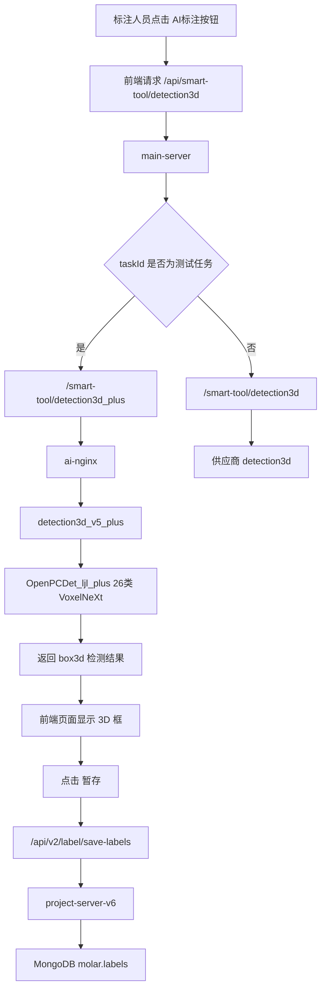

# 平台自动检测算法、OpenPCDet_ljl 26 类适配与维护手册

> 面向对象：标注负责人、算法同事、平台维护同事、后续接手服务器和代码的人。  
> 目的：讲清楚公司自动检测算法在平台中的调用链路、`OpenPCDet_ljl` 如何适配公司 26 类数据、模型如何训练与替换、标注人员如何使用 AI 标注按钮，以及服务器维护时应该检查哪些位置。  
> 当前状态：已在测试任务中打通 `detection3d_plus` 支路，原供应商 `detection3d` 生产线保留。

---

## 0. 一句话总结

当前平台原本使用供应商的 3D 自动检测服务：

```text
AI标注按钮
    -> /api/smart-tool/detection3d
    -> main-server
    -> ai-nginx /smart-tool/detection3d
    -> detection3d 供应商模型
```

我们现在新增了一条测试支路：

```text
AI标注按钮
    -> /api/smart-tool/detection3d
    -> main-server 根据测试 taskId 分流
    -> ai-nginx /smart-tool/detection3d_plus
    -> detection3d_v5_plus
    -> OpenPCDet_ljl_plus 26 类 VoxelNeXt 模型
```

所以当前不是把原供应商模型全局替换掉，而是：

```text
指定测试任务走 plus；
其他任务仍然走供应商 detection3d。
```

这就是目前最重要的安全边界。

---

## 1. 整个平台自动检测算法是什么

### 1.1 从标注人员角度看

标注人员在 3D 点云标注页面中点击 **AI标注** 按钮，平台会自动检测点云里的目标，并生成 3D 框。检测结果先显示在页面上，标注人员检查后点击 **暂存**，结果才会正式写入数据库。

完整用户流程是：

```text
打开平台页面
    -> 进入 3D 标注任务
    -> 点击 AI标注
    -> 等待模型推理完成
    -> 页面出现 3D 框
    -> 人工检查和修正
    -> 点击 暂存
    -> labels 正式写入 MongoDB
```

注意：

```text
AI标注只是把检测结果加载到前端页面；
正式落库需要点击“暂存”。
```

### 1.2 从算法角度看

自动检测算法本质上是 LiDAR 3D 目标检测模型。输入是一帧点云，输出是多个 3D 框：

```text
输入：
    pcd / bin 点云文件 URL

模型：
    OpenPCDet_ljl_plus
    VoxelNeXt
    公司 26 类 LiDAR 3D 检测模型

输出：
    box3d 列表
    每个 box 包含：
        label
        score
        points
        drawType = box3d
        frameIndex
        outside
```

平台最终保存的是符合平台标注格式的 `labels` 文档，而不是 OpenPCDet 原始 `result.pkl`。

---

## 2. 当前关键容器和职责

| 容器 | 作用 | 当前状态 |
|---|---|---|
| `molar-label-system-fe-v2` | 平台前端页面，包含 AI 标注按钮逻辑 | 已 patch，当前测试任务可触发实时 AI 标注 |
| `main-server` | 平台主后端，接收 `/api/smart-tool/detection3d` | 已按测试 taskId 分流到 plus |
| `ai-nginx` | AI 服务网关，转发 `/smart-tool/*` | 已新增 `/smart-tool/detection3d_plus` |
| `detection3d` | 供应商原 3D 检测服务 | 保留，仍正常 |
| `detection3d_v5_plus` | plus 测试模型服务 | 运行 OpenPCDet_ljl_plus 模型 |
| `project-server-v6` | 标签保存服务 | `/api/v2/label/save-labels` 可保存结果 |
| `mongodb` | 平台数据库 | `molar.labels` 保存正式标注结果 |

---

## 3. 当前成功链路

当前测试任务：

```text
taskId = 69fe8f840fa06ee86bde27a6
任务名：test3d-260509
```

当前验证过的成功链路：



实际验证结果：

```text
AI标注按钮点击后：
main-server 日志出现 /api/smart-tool/detection3d；
main-server 转发到 /smart-tool/detection3d_plus；
ai-nginx 日志出现 POST /smart-tool/detection3d_plus；
页面显示 151 个标签；
点击“暂存”后 MongoDB labels = 151。
```

说明：

```text
当前测试任务的 AI 标注按钮已经成功走 plus 支路。
```

---

## 4. 为什么要走“支路”，而不是直接替换原 detection3d

因为原平台还有生产标注任务在用供应商模型。如果直接把：

```text
/smart-tool/detection3d
```

全局改成 plus，一旦 plus 服务挂掉、类别不兼容、框太多或输出异常，就会影响其他任务。

所以当前采用安全策略：

```text
原生产路径不动：
    /smart-tool/detection3d -> detection3d 供应商模型

新增测试路径：
    /smart-tool/detection3d_plus -> detection3d_v5_plus plus 模型

main-server 做任务级分流：
    当前测试 taskId -> detection3d_plus
    其他 taskId -> detection3d
```

这个策略的好处：

```text
1. 不破坏原供应商自动标注功能；
2. 方便测试 plus 模型；
3. 出问题可以快速回滚；
4. 后续可以逐步扩大到更多测试任务；
5. 可以在正式上线前验证类别、保存、导出、质检、统计流程。
```

---

## 5. OpenPCDet_ljl 是如何适配公司数据集的

### 5.1 原始 OpenPCDet 和公司数据的差异

原始 OpenPCDet 支持 KITTI、nuScenes、Waymo 等常见数据集。公司数据虽然采用类似 nuScenes 的 JSON 组织方式，但仍有差异：

```text
1. 公司类别不是 nuScenes 官方 10 类，而是公司自定义 26 类；
2. 数据目录、点云路径、样本文件可能和标准 nuScenes 不完全一致；
3. 点云文件需要平台/训练代码都能闭环读取；
4. 需要生成 OpenPCDet 训练使用的 info pkl；
5. 需要自定义 dataset 类读取公司 JSON 和 LiDAR；
6. 需要自定义类别映射、训练配置和评估脚本。
```

因此项目不是“直接拿原版 OpenPCDet 训练”，而是在 OpenPCDet 上做了公司数据适配。

### 5.2 当前推荐分支

当前推荐使用：

```text
仓库：
https://github.com/ljl71/OpenPCDet_ljl

分支：
codex/company-26cls-evaluation-plus
```

该分支目标是：

```text
使用公司正式数据训练和评估 26 类 VoxelNeXt LiDAR 3D 检测模型。
```

### 5.3 数据目录结构

正式数据推荐放在：

```text
/workspace/OpenPCDet/data/nuscenes/
    samples/
        LIDAR_TOP/
            *.bin
    v1.0-trainval/
        category.json
        instance.json
        sample.json
        sample_data.json
        sample_annotation.json
        scene.json
        calibrated_sensor.json
        ego_pose.json
        ImageSets/
            train.txt
            val.txt
        company_nuscenes_infos_train.pkl
        company_nuscenes_infos_val.pkl
```

注意：

```text
不要使用早期的 data/v1.0-trainval；
已有检查显示早期目录可能仍引用无法闭环读取的 .pcd 路径。
```

### 5.4 点云格式

当前正式数据使用：

```text
samples/LIDAR_TOP/*.bin
```

点云每点 4 个 `float32`：

```text
x, y, z, intensity
```

其中第 4 列已经检查为转换占位值，不能当成真实反射强度、ring 或 timestamp。训练和推理时仍按 4 维输入处理。

### 5.5 主要新增/修改内容

从维护角度看，OpenPCDet_ljl 的核心改动包括：

```text
1. 新增 CompanyNuScenesDataset；
2. 新增 company_nuscenes_utils.py；
3. 新增 create_company_infos.py；
4. 新增 check_company_infos.py；
5. 适配公司 26 类类别名；
6. 适配公司 nuScenes 风格 JSON；
7. 生成 train/val info pkl；
8. 支持 scene-level 划分；
9. 新增正式训练配置 company_voxelnext_26cls_trainval.yaml；
10. 新增正式数据配置 company_nuscenes_trainval_dataset.yaml；
11. VoxelNeXt head 适配公司类别；
12. 新增 26 类评估统计；
13. 支持离线重算 result.pkl 指标。
```

---

## 6. 公司数据训练流程

### 6.1 进入容器和工程目录

常用容器：

```text
detection3d_v5
```

工程路径：

```text
宿主机：/home/ubuntu/WXY/OpenPCDet_ljl_plus
容器内：/workspace/OpenPCDet
数据挂载：/home/ubuntu/WXY/data -> /workspace/OpenPCDet/data
```

进入容器：

```bash
sudo docker exec -it detection3d_v5_plus /bin/bash
cd /workspace/OpenPCDet
```

### 6.2 生成 info pkl

正式数据准备好后执行：

```bash
python tools/company_nuscenes/create_company_infos.py \
  --data_path data/nuscenes \
  --save_path data/nuscenes \
  --version v1.0-trainval
```

生成结果应包括：

```text
data/nuscenes/v1.0-trainval/company_nuscenes_infos_train.pkl
data/nuscenes/v1.0-trainval/company_nuscenes_infos_val.pkl
```

### 6.3 检查 info 和路径闭环

执行：

```bash
python tools/company_nuscenes/check_company_infos.py \
  --root data/nuscenes/v1.0-trainval \
  --data_root data/nuscenes \
  --strict
```

重点看：

```text
samples > 0
missing_lidar_paths = 0
outside_config = []
类别数量合理
```

如果 `missing_lidar_paths` 不为 0，说明 JSON 中的点云路径和实际文件没有闭环，不能开始训练。

### 6.4 启动训练

从 `tools/` 目录启动训练：

```bash
cd /workspace/OpenPCDet/tools

python train.py \
  --cfg_file cfgs/nuscenes_models/company_voxelnext_26cls_trainval.yaml \
  --batch_size 1 \
  --epochs 20
```

根据 GPU 显存可以调整：

```text
batch_size
epochs
CUDA_VISIBLE_DEVICES
```

例如指定 GPU：

```bash
CUDA_VISIBLE_DEVICES=1 python train.py \
  --cfg_file cfgs/nuscenes_models/company_voxelnext_26cls_trainval.yaml \
  --batch_size 8 \
  --epochs 20
```

### 6.5 训练输出位置

典型输出目录类似：

```text
/workspace/OpenPCDet/output/nuscenes_models/company_voxelnext_26cls_trainval/
```

当前已用于平台测试的模型权重：

```text
/workspace/OpenPCDet/output/nuscenes_models/company_voxelnext_26cls_trainval/formal_company_26cls_plus_bs8_e20/ckpt/checkpoint_epoch_20.pth
```

### 6.6 评估与结果分析

当前分支支持的评估包括：

```text
每类 AP@0.5m / AP@1.0m / AP@2.0m / AP@4.0m；
整体 mAP；
precision / recall / F1；
mATE / mASE / mAOE；
0-30m、30-50m、50m+ 距离区间统计；
基于已有 result.pkl 离线重算指标。
```

这些指标适合比较不同模型版本的效果和阈值取舍，但不等同于官方 nuScenes NDS，因为公司类别不是官方 10 类，当前模型也不输出 NDS 所需的速度和属性项。

---

## 7. 将训练好的模型接入平台的部署流程

### 7.1 不建议直接改供应商 detection3d

供应商原容器：

```text
detection3d
```

仍然是生产路径：

```text
/smart-tool/detection3d -> 172.28.5.55:8000
```

不建议直接在该容器里替换模型，因为之前已经验证过，直接替换会因为配置、数据集类、base config、类别等问题导致服务启动失败。

### 7.2 plus 测试容器

当前使用：

```text
detection3d_v5_plus
```

作为 plus 模型服务容器。

该容器中核心路径：

```text
/workspace/OpenPCDet/tools/inference/fastAPI.py
/workspace/OpenPCDet/tools/inference/inference_nms.py
/workspace/OpenPCDet/tools/inference/DataSet.py
/workspace/OpenPCDet/tools/inference/nms.py
```

模型部署目录：

```text
/workspace/OpenPCDet/company_test/test1/
    checkpoint_epoch_20.pth
    company_voxelnext_26cls_trainval.yaml
    company_nuscenes_trainval_dataset.yaml
```

### 7.3 修改 inference_nms.py 模型路径

需要确保：

```text
DEFAULT_CKPT_PATH
DEFAULT_CFG_FILE
```

指向 plus 模型：

```text
DEFAULT_CKPT_PATH:
    /workspace/OpenPCDet/company_test/test1/checkpoint_epoch_20.pth

DEFAULT_CFG_FILE:
    /workspace/OpenPCDet/company_test/test1/company_voxelnext_26cls_trainval.yaml
```

### 7.4 _BASE_CONFIG_ 必须使用绝对路径

在：

```text
/workspace/OpenPCDet/company_test/test1/company_voxelnext_26cls_trainval.yaml
```

中应保证：

```yaml
_BASE_CONFIG_: /workspace/OpenPCDet/company_test/test1/company_nuscenes_trainval_dataset.yaml
```

否则 FastAPI 启动时可能报：

```text
FileNotFoundError: cfgs/dataset_configs/company_nuscenes_trainval_dataset.yaml
```

### 7.5 启动 plus API

进入容器：

```bash
sudo docker exec -it detection3d_v5_plus /bin/bash
cd /workspace/OpenPCDet
```

启动：

```bash
PYTHONPATH=/workspace/OpenPCDet:/workspace/OpenPCDet/tools/inference \
CUDA_VISIBLE_DEVICES=1 \
/opt/conda/bin/python -m uvicorn tools.inference.fastAPI:app \
  --host 0.0.0.0 \
  --port 8000
```

成功标志：

```text
Application startup complete.
Uvicorn running on http://0.0.0.0:8000
```

注意：

```text
如果这是前台进程，终端不能关闭。
如果要长期给其他标注员使用，应改成容器自启动或 supervisor/pm2/systemd 管理。
```

---

## 8. ai-nginx 支路配置

当前支路设计：

```text
原生产路径：
/smart-tool/detection3d
    -> 172.28.5.55:8000
    -> detection3d

新增 plus 测试路径：
/smart-tool/detection3d_plus
    -> 172.28.0.1:8000/smart-tool/detection3d
    -> detection3d_v5_plus
```

检查配置：

```bash
sudo docker exec ai-nginx sh -lc 'grep -n "detection3d_plus\|detection3d" /etc/nginx/nginx.conf'
```

应看到类似：

```text
location = /smart-tool/detection3d_plus {
    proxy_pass http://172.28.0.1:8000/smart-tool/detection3d;
}

location /smart-tool/detection3d {
    proxy_pass http://172.28.5.55:8000;
}
```

测试：

```bash
curl -i http://127.0.0.1:8000/smart-tool/detection3d_plus
```

如果返回：

```text
405 Method Not Allowed
allow: POST
```

说明路径已经进入 FastAPI，只是 GET 方法不被允许，这是正常现象。

---

## 9. main-server 支路分流逻辑

### 9.1 当前分流方式

`main-server` 中当前对测试任务做了 taskId 级别分流：

```js
async detection3d(dto, user) {
    const taskId = dto.taskId;
    const params = dto.params;
    const route = taskId === '69fe8f840fa06ee86bde27a6'
        ? '/smart-tool/detection3d_plus'
        : '/smart-tool/detection3d';
    const url = this.configService.get('ai.domain') + route;
    return await this.toolService.start(taskId, url, params, user);
}
```

含义：

```text
当前测试任务 -> plus；
其他任务 -> 供应商。
```

### 9.2 为什么不只改 aiPower

平台 `task-info` 中存在：

```text
setting.aiPower
```

但已验证：

```text
修改 aiPower 为 detection3d_plus 后，
main-server 实际仍然会请求 /smart-tool/detection3d。
```

原因是 `main-server` 中 `detection3d` 方法原本硬编码了：

```text
/smart-tool/detection3d
```

所以当前必须依赖 main-server 的 taskId 分流逻辑。

### 9.3 后续工程化建议

当前写死 taskId 只是测试方案。后续更合理的方式是配置化：

```text
方案 A：
在数据库 task.setting 中增加字段，例如:
    setting.useDetection3DPlus = true

方案 B：
维护一张 plus 任务白名单表:
    plus_task_ids = [...]

方案 C：
在管理后台配置 aiPower 与具体后端路由映射。
```

不建议长期在编译后的 `dist/main/main.js` 中硬编码 taskId。

---

## 10. 前端 AI 标注按钮补丁

### 10.1 原始问题

前端 AI 标注按钮原本在打包 JS 中写死了 demo 结果：

```js
const Se = "https://molar-publish.oss-cn-hangzhou.aliyuncs.com/ai-demo/642568f685975ed9a12372f6-result.json"
g = (await qs.get(Se,{responseType:"json"})).data
```

这导致点击按钮时不一定真正调用模型，而是读取 OSS 上的历史 demo `result.json`。

现象是：

```text
点击 AI标注按钮；
后端 main-server / ai-nginx 没有新日志；
Network 中只看到 molar-publish ... result.json。
```

### 10.2 当前补丁思路

当前补丁将无条件读取 OSS demo 的逻辑改为只在 demo item 上读取：

```text
如果当前 item 是 demo item:
    读取 OSS demo result.json

否则:
    走正常 AI 工具逻辑
```

因此在当前测试任务中，点击 AI标注按钮会真正请求：

```text
/api/smart-tool/detection3d
```

再由 main-server 分流到 plus。

### 10.3 前端文件位置

当前 patch 的前端 chunk：

```text
/code/molar-label-system-fe-v2/assets/index.vue_vue_type_style_index_0_lang-5fbe0bdf.js
```

备份文件：

```text
/code/molar-label-system-fe-v2/assets/index.vue_vue_type_style_index_0_lang-5fbe0bdf.js.bak_ai_demo_oss_20260529
```

注意：

```text
当前是直接 patch 打包后的 JS 文件；
后续正式上线应回到前端源码中修改，再重新构建发布。
```

---

## 11. 其他标注人员如何使用 plus 支路

### 11.1 生效条件

其他标注人员在其他电脑上也能使用当前 plus 支路，但必须满足：

```text
1. 访问同一个平台地址；
2. 进入同一个测试任务；
3. 浏览器加载到服务器上已经 patch 的前端 JS；
4. detection3d_v5_plus 服务正在运行；
5. main-server 和 ai-nginx 当前补丁未回滚。
```

平台地址：

```text
http://172.23.131.39:8080
```

测试任务：

```text
taskId = 69fe8f840fa06ee86bde27a6
```

### 11.2 标注人员操作流程

给标注人员的简化说明：

```text
1. 打开平台： http://172.23.131.39:8080
2. 登录账号；
3. 进入指定测试任务；
4. 首次使用前按 Ctrl + Shift + R 强刷页面；
5. 打开某个点云 item；
6. 点击 AI标注按钮；
7. 等待自动检测框加载出来；
8. 人工检查并修正；
9. 点击 暂存；
10. 切换到下一帧或提交。
```

### 11.3 为什么要强刷

因为前端 JS 文件名没有变化，浏览器可能缓存旧 JS。其他电脑第一次测试时建议：

```text
Ctrl + Shift + R
```

或者清理浏览器缓存。

如果不强刷，可能出现：

```text
仍然读取旧 OSS demo result.json；
点击按钮后后端没有 detection3d_plus 日志；
页面结果不符合预期。
```

### 11.4 当前不建议大范围正式使用

虽然其他电脑可以使用当前支路，但目前建议只做小范围验证：

```text
1. 前端仍是 patch 打包 JS；
2. main-server 分流仍是写死 taskId；
3. plus 服务可能仍是手动前台启动；
4. plus 返回框数量偏多；
5. score 阈值、类别阈值、Top-N 过滤尚未最终确定；
6. 导出、统计、审核、质检流程仍需继续验证。
```

因此当前建议：

```text
可以让一两名同事验证；
暂不建议直接开放给大量正式标注人员。
```

---

## 12. 每次测试时应该怎么确认真的走了 plus

### 12.1 看 main-server 日志

```bash
sudo docker exec main-server sh -lc 'tail -f /code/logs/2026-05-29.log' \
  | grep --line-buffered -E "ToolService.request|detection3d_plus|detection3d"
```

期望看到：

```text
path: /api/smart-tool/detection3d
url=http://172.28.5.50:8000/smart-tool/detection3d_plus
```

### 12.2 看 ai-nginx 日志

```bash
sudo docker logs -f --tail 0 ai-nginx 2>&1 \
  | grep --line-buffered -E "detection3d_plus|detection3d|smart-tool"
```

期望看到：

```text
POST /smart-tool/detection3d_plus HTTP/1.1 200
```

### 12.3 查 MongoDB 是否保存

点击 AI 标注后，页面出现框但还没有点击暂存时，数据库可能仍然是 0。

点击 **暂存** 后再查：

```bash
MONGO_PWD=$(sudo docker inspect mongodb --format '{{range .Config.Env}}{{println .}}{{end}}' | sed -n 's/^MONGO_INITDB_ROOT_PASSWORD=//p'); sudo docker exec -i mongodb mongosh --quiet -u root -p "$MONGO_PWD" --authenticationDatabase admin --eval 'const d=db.getSiblingDB("molar"); const itemId=ObjectId("<ITEM_ID>"); print("labels:", d.labels.countDocuments({itemId})); print("pre_labels:", d.pre_labels.countDocuments({itemId})); printjson(d.labels.aggregate([{$match:{itemId}},{$group:{_id:"$data.label", count:{$sum:1}}},{$sort:{count:-1}}]).toArray());'
```

如果保存成功，应看到：

```text
labels > 0
pre_labels = 0
```

---

## 13. 重新训练更好模型后如何替换

### 13.1 只换同结构 checkpoint

如果新模型仍然是：

```text
OpenPCDet_ljl_plus
VoxelNeXt
当前 26 类
同一套 yaml
同一输出格式
同一 label 名
```

只需要：

```text
1. 将新 checkpoint 放到 plus 容器；
2. 修改 inference_nms.py 中 DEFAULT_CKPT_PATH；
3. 重启 detection3d_v5_plus FastAPI；
4. curl 测试；
5. 页面测试；
6. 暂存后查 labels。
```

不需要再改：

```text
ai-nginx
main-server
前端 JS
save-labels
```

### 13.2 checkpoint 和 yaml 都变了

如果新训练实验使用了新 yaml，则要同时检查：

```text
DEFAULT_CKPT_PATH
DEFAULT_CFG_FILE
_BASE_CONFIG_
```

推荐新建目录：

```text
/workspace/OpenPCDet/company_test/test2/
    checkpoint_epoch_XX.pth
    company_voxelnext_26cls_trainval.yaml
    company_nuscenes_trainval_dataset.yaml
```

然后确保 `_BASE_CONFIG_` 是绝对路径：

```yaml
_BASE_CONFIG_: /workspace/OpenPCDet/company_test/test2/company_nuscenes_trainval_dataset.yaml
```

### 13.3 代码结构也变了

如果模型代码、Dataset、NMS、后处理都变了，不建议覆盖当前 `detection3d_v5_plus`。

建议：

```text
新建 detection3d_v6_plus；
单独接入 mooredata_my-network；
单独启动服务；
新增或临时切换 detection3d_plus 指向；
验证通过后再替换。
```

这样当前 `detection3d_v5_plus` 可作为可回滚基线。

### 13.4 推荐 current 目录

后续建议固定：

```text
/workspace/OpenPCDet/company_test/current/
    checkpoint.pth
    model.yaml
    dataset.yaml
```

`inference_nms.py` 永远指向 current：

```text
DEFAULT_CKPT_PATH = /workspace/OpenPCDet/company_test/current/checkpoint.pth
DEFAULT_CFG_FILE = /workspace/OpenPCDet/company_test/current/model.yaml
```

以后换同结构模型只替换 current 文件并重启服务即可。

---

## 14. 换模型后的标准验证清单

每次换模型后都按以下顺序检查：

```text
1. detection3d_v5_plus 能否启动；
2. 日志是否显示 loaded checkpoint；
3. curl /smart-tool/detection3d_plus 是否 code=200；
4. 统计返回框数量、类别、score 分布；
5. curl 原 /smart-tool/detection3d 是否仍正常；
6. 打开测试任务页面；
7. Ctrl + Shift + R 强刷；
8. 点击 AI标注；
9. 看 main-server 是否转发到 detection3d_plus；
10. 看 ai-nginx 是否出现 POST /smart-tool/detection3d_plus；
11. 页面是否显示框；
12. 点击暂存；
13. 查 MongoDB labels；
14. 检查导出、统计、质检是否正常。
```

---

## 15. 常用检查命令

### 15.1 检查容器

```bash
sudo docker ps | grep -E "detection3d|ai-nginx|main-server|project-server-v6|molar-label"
```

### 15.2 检查 plus 服务

```bash
curl -I http://172.28.0.1:8000/docs
```

### 15.3 检查 ai-nginx 配置

```bash
sudo docker exec ai-nginx sh -lc 'grep -n "detection3d_plus\|detection3d" /etc/nginx/nginx.conf'
```

### 15.4 检查 main-server 分流

```bash
sudo docker exec main-server sh -lc "sed -n '39246,39260p' /code/dist/main/main.js"
```

### 15.5 检查前端 patch 文件

```bash
sudo docker exec molar-label-system-fe-v2 sh -lc 'ls -lh /code/molar-label-system-fe-v2/assets/index.vue_vue_type_style_index_0_lang-5fbe0bdf.js*'
```

### 15.6 检查供应商原接口

```bash
curl -sS -X POST http://127.0.0.1:8000/smart-tool/detection3d \
  -H "Content-Type: application/json" \
  -d "{\"pcURL\":\"$PCURL\",\"shape\":4,\"model\":\"model\"}" \
  -o /tmp/vendor_direct_check.json
```

### 15.7 检查 plus 接口

```bash
curl -sS -X POST http://127.0.0.1:8000/smart-tool/detection3d_plus \
  -H "Content-Type: application/json" \
  -d "{\"pcURL\":\"$PCURL\",\"shape\":4,\"model\":\"model\"}" \
  -o /tmp/plus_direct_check.json
```

### 15.8 检查保存接口

```bash
curl -sS -i -X POST http://172.23.131.39:8080/api/v2/label/save-labels \
  -H "Content-Type: application/json" \
  -H "access-token: <ACCESS_TOKEN>" \
  --data-binary @/tmp/save_labels_payload.json
```

---

## 16. 常见问题排查

### 16.1 点 AI标注后没有任何后端日志

可能原因：

```text
1. 前端缓存旧 JS；
2. 没有进入测试任务；
3. AI按钮仍在读 OSS demo result.json；
4. plus 前端 patch 被回滚。
```

处理：

```text
Ctrl + Shift + R 强刷；
打开 Network 看是否请求 /api/smart-tool/detection3d；
看 main-server 日志。
```

### 16.2 页面出现框，但 MongoDB labels 仍然是 0

原因：

```text
只点击了 AI标注，没有点击 暂存。
```

处理：

```text
点击 暂存；
再查 labels。
```

### 16.3 detection3d_plus 返回 404

可能原因：

```text
ai-nginx 中没有新增 /smart-tool/detection3d_plus；
nginx 配置没有 reload；
路径写错。
```

处理：

```bash
sudo docker exec ai-nginx nginx -t
sudo docker exec ai-nginx nginx -s reload
sudo docker exec ai-nginx sh -lc 'grep -n "detection3d_plus" /etc/nginx/nginx.conf'
```

### 16.4 plus 服务无法访问

可能原因：

```text
detection3d_v5_plus 没启动；
uvicorn 终端关闭；
容器不在 mooredata_my-network；
GPU 或 Python 环境报错。
```

处理：

```bash
sudo docker ps | grep detection3d_v5_plus
curl -I http://172.28.0.1:8000/docs
sudo docker inspect detection3d_v5_plus
```

### 16.5 FastAPI 启动报 _BASE_CONFIG_ 找不到

原因：

```text
yaml 内部 _BASE_CONFIG_ 仍是相对路径。
```

处理：

```text
把 _BASE_CONFIG_ 改为绝对路径。
```

### 16.6 框数量太多

当前 plus 模型可能返回较多低分框。需要后续加入：

```text
score 阈值；
类别阈值；
最多保存 Top-N；
不同类别不同阈值。
```

可以先统计 score 分布，再决定阈值。

### 16.7 其他标注人员说按钮没效果

检查：

```text
是否访问同一服务器；
是否进入测试任务；
是否 Ctrl + Shift + R；
plus 服务是否还在；
main-server 是否仍有 taskId 分流；
ai-nginx 是否有 detection3d_plus 日志。
```

---

## 17. 回滚方案

### 17.1 回滚前端 patch

```bash
sudo docker exec molar-label-system-fe-v2 sh -lc 'cp /code/molar-label-system-fe-v2/assets/index.vue_vue_type_style_index_0_lang-5fbe0bdf.js.bak_ai_demo_oss_20260529 /code/molar-label-system-fe-v2/assets/index.vue_vue_type_style_index_0_lang-5fbe0bdf.js'
```

### 17.2 回滚 main-server 分流

```bash
sudo docker exec main-server sh -lc 'cp /code/dist/main/main.js.bak_detection3d_plus_task_69fe8f /code/dist/main/main.js'
sudo docker restart main-server
```

### 17.3 回滚 ai-nginx plus 路径

```bash
sudo docker exec ai-nginx sh -lc 'cat /tmp/nginx.conf.before_detection3d_plus > /etc/nginx/nginx.conf'
sudo docker exec ai-nginx nginx -t
sudo docker exec ai-nginx nginx -s reload
```

### 17.4 停止 plus API

如果 plus API 是前台启动的：

```text
在对应终端按 Ctrl + C
```

### 17.5 清空某个 item 的测试标注

```bash
MONGO_PWD=$(sudo docker inspect mongodb --format '{{range .Config.Env}}{{println .}}{{end}}' | sed -n 's/^MONGO_INITDB_ROOT_PASSWORD=//p'); sudo docker exec -i mongodb mongosh --quiet -u root -p "$MONGO_PWD" --authenticationDatabase admin --eval 'const d=db.getSiblingDB("molar"); const itemId=ObjectId("<ITEM_ID>"); print("before labels:", d.labels.countDocuments({itemId})); printjson(d.labels.deleteMany({itemId})); print("after labels:", d.labels.countDocuments({itemId}));'
```

---

## 18. 讲解

可以按三层讲：

### 第一层：业务人员

```text
平台有一个 AI标注按钮；
点击后，后台模型会自动检测点云里的车、人、摩托车等目标；
检测结果会显示成 3D 框；
标注员需要检查和修正；
点暂存后才会正式保存。
```

### 第二层：平台维护

```text
按钮请求 /api/smart-tool/detection3d；
main-server 接到请求后，根据 taskId 判断走原供应商模型还是 plus 模型；
plus 模型通过 ai-nginx 的 /smart-tool/detection3d_plus 转发；
模型返回 box3d；
前端显示结果；
暂存时调用 save-labels 写入 MongoDB。
```

### 第三层：算法维护

```text
plus 模型来自 OpenPCDet_ljl；
基于 VoxelNeXt；
适配公司 nuScenes 风格 26 类数据；
训练前要生成 company_nuscenes_infos_train/val.pkl；
训练后得到 checkpoint；
部署时把 checkpoint 和 yaml 放入 detection3d_v5_plus；
FastAPI 加载模型；
平台通过 HTTP pcURL 调用模型推理。
```

---

## 19. 后续工程化建议

当前已经跑通，但还不是最终生产化形态。建议后续逐步完成：

```text
1. 将 front-end patch 回写到前端源码，重新构建；
2. 将 main-server taskId 分流改为配置化；
3. 将 detection3d_v5_plus 改为容器自启动；
4. 固定 current 模型目录；
5. 增加 score 阈值和 Top-N 控制；
6. 完整验证导出、统计、审核、质检；
7. 增加一键健康检查脚本；
8. 增加一键切换模型版本脚本；
9. 增加回滚脚本；
10. 整理标注人员使用说明。
```

---

## 20. 当前阶段性结论

当前最重要的结论：

```text
OpenPCDet_ljl_plus 26 类 VoxelNeXt 模型已经成功接入平台测试支路；
AI标注按钮在当前测试任务中已经能走 detection3d_plus；
点击暂存后结果可以正式写入 MongoDB labels；
供应商原 detection3d 线仍然正常。
```

当前仍需谨慎的点：

```text
当前只建议测试任务使用；
不建议直接对所有生产任务开放；
后续需要做阈值控制、服务自启动、正式前端构建和任务配置化。
```

---

## 附录：资料来源

```text
1. 当前会话中的 OpenPCDet_ljl_plus 接入自动标注平台前置操作记录；
2. OpenPCDet_ljl 仓库 codex/company-26cls-evaluation-plus 分支；
3. COMPANY_NUSCENES_26CLS_GUIDE.md；
4. OpenPCDet_ljl 26 类 VoxelNeXt runbook；
5. 平台实际测试日志、curl 输出、MongoDB 查询结果。
```
